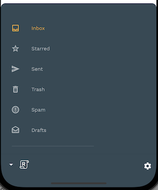

# Flutter Motion Transitions

A fultter app to demonstrate Material motion system.

## Material Motion System
The four main Material transition patterns are as follows:

### Container Transform: 

Transitions between UI elements that include a container; creates a visible connection between two distinct UI elements by seamlessly transforming one element into another.

### Shared Axis: 

Transitions between UI elements that have a spatial or navigational relationship; uses a shared transformation on the x, y, or z axis to reinforce the relationship between elements.

### Fade Through: 

Transitions between UI elements that do not have a strong relationship to each other; uses a sequential fade out and fade in, with a scale of the incoming element.

### Fade: 
Used for UI elements that enter or exit within the bounds of the screen.

## App's Functionality

1. Show a dummy list of messages in Home page.
2. Implement an animated bottom app bar.

3. Change app's theme dynamically from settings bottom sheet.

4. Change app's animation speed from settings.

5. Implement bottom drawer menu.

## Transition Animations

| Animation Name        |      Screenshot     |
|-----------------------|:--------------------|
| Container Transform transition (List to detail page) |  
| Container Transform transition from FAB to create page |    
| Shared Z-Axis transition from search icon to search page  | 
| Fade through transition | 
| Theme transition | 

UI is inspired from [Reply App](https://material.io/design/material-studies/reply.html#about-reply)